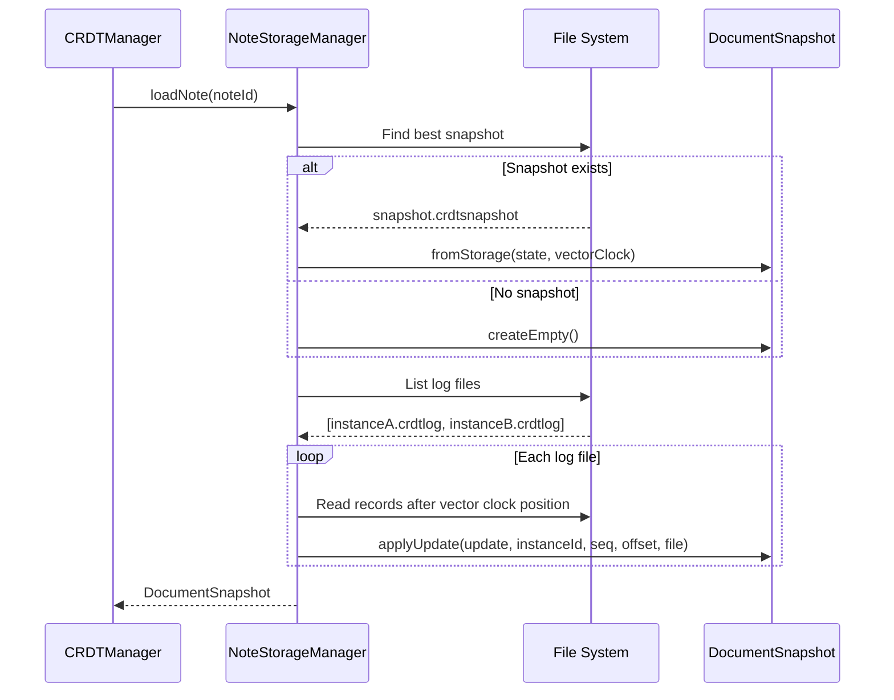
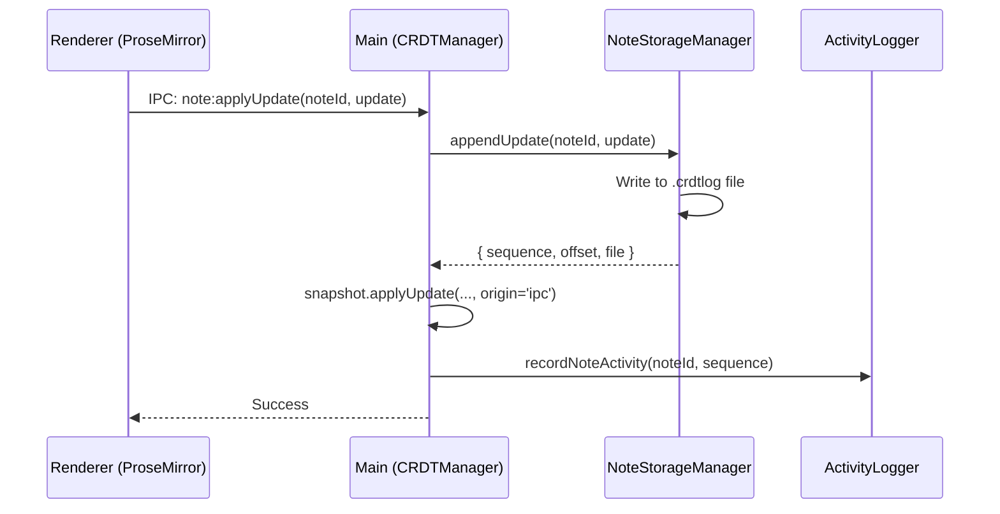

# Storage Architecture

This document describes the NoteCove storage layer architecture, including the file layout, CRDT implementation, and binary formats.

## Overview

NoteCove uses a **conflict-free replicated data type (CRDT)** approach for data storage, built on the [Yjs](https://docs.yjs.dev/) library. This enables:

- **Offline-first editing** - Notes are stored locally and work without network
- **Multi-instance sync** - Multiple machines can edit the same notes via cloud storage
- **Automatic conflict resolution** - Concurrent edits merge automatically

### Architecture Layers

```
┌─────────────────────────────────────────────────────────┐
│                  Electron Renderer                       │
│            (ProseMirror editor, React UI)               │
└────────────────────────┬────────────────────────────────┘
                         │ IPC (Y.Doc updates)
┌────────────────────────▼────────────────────────────────┐
│                   Electron Main                          │
│                  (CRDTManager)                          │
│  ┌─────────────────────────────────────────────────┐   │
│  │              packages/desktop                    │   │
│  │  - CRDTManager: orchestrates notes/folders      │   │
│  │  - ActivitySync: cross-instance coordination    │   │
│  │  - DeletionSync: permanent deletion handling    │   │
│  └─────────────────────────────────────────────────┘   │
└────────────────────────┬────────────────────────────────┘
                         │
┌────────────────────────▼────────────────────────────────┐
│                  packages/shared                         │
│  ┌─────────────────────────────────────────────────┐   │
│  │  Storage Layer                                   │   │
│  │  - NoteStorageManager: note CRDT persistence    │   │
│  │  - FolderStorageManager: folder tree CRDT       │   │
│  │  - DocumentSnapshot: Y.Doc + VectorClock pair   │   │
│  │  - Binary format utilities                       │   │
│  └─────────────────────────────────────────────────┘   │
│  ┌─────────────────────────────────────────────────┐   │
│  │  CRDT Layer                                      │   │
│  │  - NoteDoc: Y.XmlFragment for rich text         │   │
│  │  - FolderTreeDoc: Y.Map for folder hierarchy    │   │
│  └─────────────────────────────────────────────────┘   │
└────────────────────────┬────────────────────────────────┘
                         │
┌────────────────────────▼────────────────────────────────┐
│            File System (Storage Directory)              │
│  - SQLite database (cache only)                         │
│  - CRDT log files (.crdtlog)                           │
│  - Snapshot files (.crdtsnapshot)                       │
└─────────────────────────────────────────────────────────┘
```

## Storage Directory (SD) Structure

Each Storage Directory (SD) contains all data for a set of notes. Users can have multiple SDs, and SDs can be placed in cloud-synced folders (iCloud, Google Drive, Dropbox).

```
{SD_PATH}/
├── .sd-uuid                     # Globally unique SD identifier
├── notes/
│   └── {noteId}/
│       ├── logs/
│       │   ├── {instanceId}_{timestamp}.crdtlog    # Append-only update logs
│       │   └── ...
│       └── snapshots/
│           └── {timestamp}.crdtsnapshot            # Periodic full-state snapshots
├── folders/
│   └── logs/
│       └── {instanceId}_{timestamp}.crdtlog        # Folder tree CRDT logs
├── activity/
│   └── {instanceId}.log         # Activity log for cross-instance sync
├── deleted/
│   └── {instanceId}.log         # Deletion log for permanent deletes
├── media/
│   └── {hash}.{ext}             # Embedded images/attachments
└── profiles/
    └── {instanceId}.json        # Presence info for this instance
```

### Key Concepts

- **Instance ID**: A unique identifier for each running instance of NoteCove (e.g., `macbook-pro-abc123`)
- **SD UUID**: A globally unique identifier for the Storage Directory, stored in `.sd-uuid`
- **Note ID**: A UUID identifying each note

## CRDT Implementation

### NoteDoc (packages/shared/src/crdt/note-doc.ts)

Notes use `Y.XmlFragment` to store rich text content compatible with ProseMirror:

```typescript
// Simplified view of NoteDoc structure
class NoteDoc {
  private doc: Y.Doc;
  private fragment: Y.XmlFragment; // Rich text content

  constructor() {
    this.doc = new Y.Doc();
    this.fragment = this.doc.getXmlFragment('content');
  }

  getDoc(): Y.Doc {
    return this.doc;
  }
  getFragment(): Y.XmlFragment {
    return this.fragment;
  }
}
```

The `Y.XmlFragment` maps directly to ProseMirror's document model:

- Headings, paragraphs, lists are `Y.XmlElement` nodes
- Text content is `Y.Text` with marks for formatting (bold, italic, etc.)
- Checkboxes, code blocks, etc. are custom `Y.XmlElement` types

### FolderTreeDoc (packages/shared/src/crdt/folder-tree-doc.ts)

The folder hierarchy uses `Y.Map` for each folder:

```typescript
// Folder structure in Y.Map
interface FolderData {
  id: string;
  name: string;
  parentId: string | null; // null = root folder
  sdId: string;
  order: number; // Sort order within parent
  deleted: boolean; // Soft-delete flag
}

// The FolderTreeDoc stores a Y.Map<string, FolderData>
```

### DocumentSnapshot (packages/shared/src/storage/document-snapshot.ts)

The `DocumentSnapshot` class ensures the Y.Doc and its vector clock are always properly paired:

```typescript
class DocumentSnapshot {
  private doc: Y.Doc;
  private vectorClock: VectorClock;

  // Apply update with strict sequence validation
  applyUpdate(
    update: Uint8Array,
    instanceId: string,
    sequence: number,
    offset: number,
    file: string,
    origin?: unknown
  ): void {
    // Validates sequence is next expected for this instance
    // Applies update to Y.Doc
    // Updates vector clock atomically
  }
}
```

Key invariants:

- Vector clock is ONLY updated when updates are applied to the document
- Sequence numbers per instance must be contiguous (no gaps)
- The `origin` parameter allows distinguishing update sources (e.g., `'ipc'` for renderer-initiated)

## Binary File Formats

### CRDT Log Format (.crdtlog)

Append-only log files store incremental Yjs updates:

```
┌─────────────────────────────────────────────────────────┐
│ Header (5 bytes)                                         │
│  ├─ Magic: 0x4E434C47 ("NCLG") [4 bytes, big-endian]   │
│  └─ Version: 1 [1 byte]                                 │
├─────────────────────────────────────────────────────────┤
│ Record 1                                                 │
│  ├─ Sequence Number [varint, LEB128]                    │
│  ├─ Data Length [varint, LEB128]                        │
│  └─ Update Data [variable length bytes]                 │
├─────────────────────────────────────────────────────────┤
│ Record 2                                                 │
│  └─ ...                                                  │
└─────────────────────────────────────────────────────────┘
```

- **Varint encoding**: Uses unsigned LEB128 for compact integer storage
- **Sequence numbers**: Start at 1, must be contiguous per file
- **Update data**: Raw Yjs update bytes

For detailed binary format specifications, see [Storage Format Design](/technical_documents/STORAGE-FORMAT-DESIGN).

### Snapshot Format (.crdtsnapshot)

Periodic full-state captures for faster loading:

```
┌─────────────────────────────────────────────────────────┐
│ Header (6 bytes)                                         │
│  ├─ Magic: 0x4E435353 ("NCSS") [4 bytes, big-endian]   │
│  ├─ Version: 1 [1 byte]                                 │
│  └─ Status: 0x00=incomplete, 0x01=complete [1 byte]    │
├─────────────────────────────────────────────────────────┤
│ Vector Clock [JSON, null-terminated]                    │
│  └─ { "instanceId": { sequence, offset, file }, ... }  │
├─────────────────────────────────────────────────────────┤
│ State Length [4 bytes, big-endian]                      │
├─────────────────────────────────────────────────────────┤
│ Y.Doc State [variable length bytes]                     │
│  └─ Output of Y.encodeStateAsUpdate(doc)               │
└─────────────────────────────────────────────────────────┘
```

- **Status byte**: Used as a "flag byte" for cloud storage safety (see [Sync Mechanism](/architecture/sync-mechanism))
- **Vector clock**: Tracks exactly which updates are included in this snapshot
- **State**: Full Yjs document state for fast reconstruction

## Vector Clock

The vector clock tracks sync progress per instance:

```typescript
interface VectorClock {
  [instanceId: string]: {
    sequence: number; // Highest applied sequence number
    offset: number; // Byte offset in the log file
    file: string; // Log file name
  };
}
```

Example:

```json
{
  "macbook-abc123": {
    "sequence": 42,
    "offset": 8192,
    "file": "macbook-abc123_1702234567890.crdtlog"
  },
  "iphone-xyz789": { "sequence": 17, "offset": 2048, "file": "iphone-xyz789_1702234600000.crdtlog" }
}
```

This allows:

- Detecting which updates have been applied
- Resuming sync from the correct position
- Validating update ordering (no gaps allowed)

## Loading a Note



## Saving Updates

When the user edits a note:



Note: The `origin='ipc'` parameter prevents double-writes when the Y.Doc's `'update'` event fires.

## Key Files Reference

| File                        | Location                          | Purpose                     |
| --------------------------- | --------------------------------- | --------------------------- |
| `document-snapshot.ts`      | `packages/shared/src/storage/`    | Y.Doc + VectorClock pairing |
| `note-storage-manager.ts`   | `packages/shared/src/storage/`    | Note CRDT persistence       |
| `folder-storage-manager.ts` | `packages/shared/src/storage/`    | Folder tree persistence     |
| `binary-format.ts`          | `packages/shared/src/storage/`    | LEB128 varint encoding      |
| `log-reader.ts`             | `packages/shared/src/storage/`    | Read .crdtlog files         |
| `log-writer.ts`             | `packages/shared/src/storage/`    | Write .crdtlog files        |
| `snapshot-reader.ts`        | `packages/shared/src/storage/`    | Read .crdtsnapshot files    |
| `snapshot-writer.ts`        | `packages/shared/src/storage/`    | Write .crdtsnapshot files   |
| `crdt-manager.ts`           | `packages/desktop/src/main/crdt/` | Main process orchestration  |
| `note-doc.ts`               | `packages/shared/src/crdt/`       | Note Y.XmlFragment wrapper  |
| `folder-tree-doc.ts`        | `packages/shared/src/crdt/`       | Folder Y.Map wrapper        |

## Next Steps

- [Learn about sync mechanism](/architecture/sync-mechanism)
- [Understand data models](/architecture/data-models)
- [View detailed format specification](/technical_documents/STORAGE-FORMAT-DESIGN)
- [Explore the tech stack](/architecture/tech-stack)
