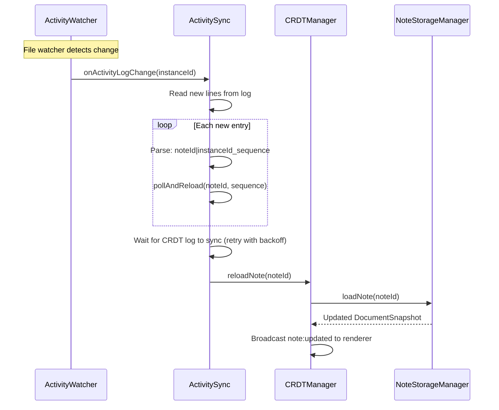
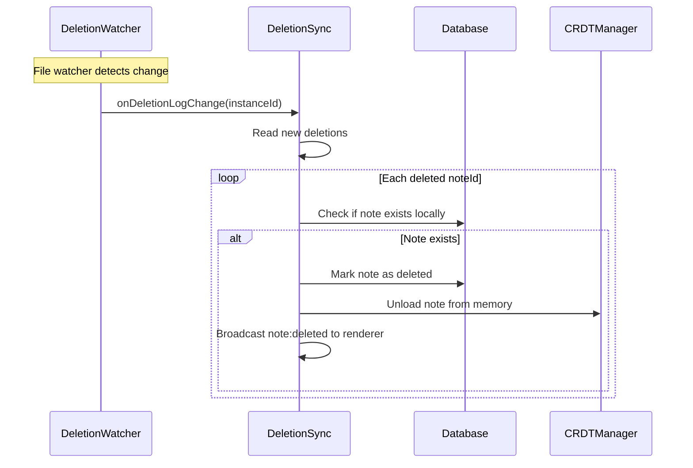
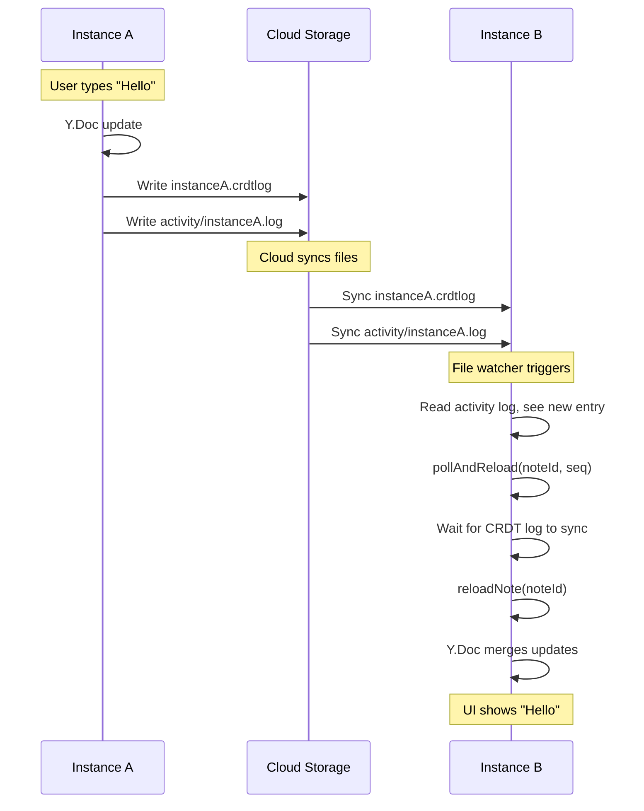
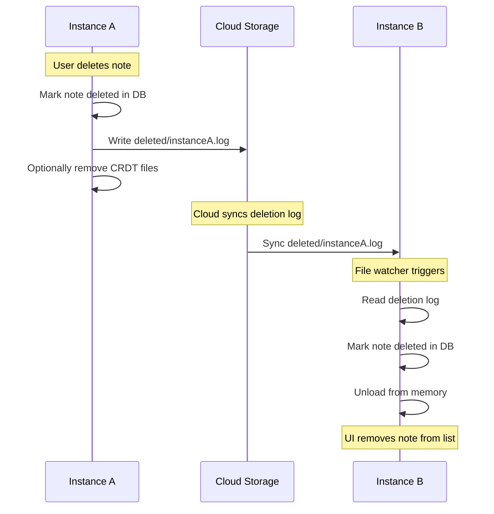
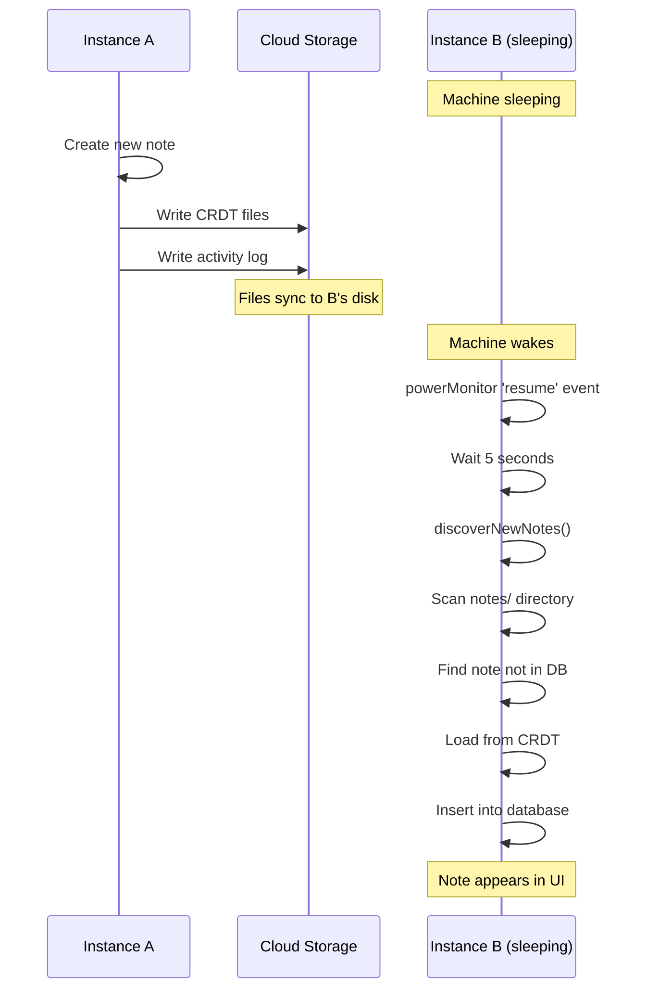

# Cross-Instance Sync Mechanism

This document describes how NoteCove synchronizes data between multiple instances (machines) using cloud storage services like iCloud, Google Drive, or Dropbox.

## Overview

NoteCove achieves multi-instance sync **without a central server** by:

1. Each instance writes to its own log files (no multi-writer conflicts)
2. Activity logs notify other instances of changes
3. Instances poll and reload changed notes from shared storage
4. Deletion logs ensure permanent deletes propagate correctly

```
┌──────────────────┐                    ┌──────────────────┐
│   Instance A     │                    │   Instance B     │
│   (MacBook)      │                    │   (iMac)         │
│                  │                    │                  │
│  ┌────────────┐  │                    │  ┌────────────┐  │
│  │ Y.Doc      │  │                    │  │ Y.Doc      │  │
│  └─────┬──────┘  │                    │  └─────┬──────┘  │
│        │write    │                    │        │write    │
│        ▼         │                    │        ▼         │
│  instanceA.crdtlog                    │  instanceB.crdtlog
│        │         │                    │        │         │
└────────┼─────────┘                    └────────┼─────────┘
         │                                       │
         └──────────────┬────────────────────────┘
                        │
              ┌─────────▼─────────┐
              │   Cloud Storage   │
              │  (iCloud/GDrive)  │
              │                   │
              │ notes/{noteId}/   │
              │   logs/           │
              │   ├─instanceA.log │
              │   └─instanceB.log │
              │ activity/         │
              │   ├─instanceA.log │
              │   └─instanceB.log │
              └───────────────────┘
```

## Activity Log System

### Purpose

Activity logs notify other instances that a note has been modified. Without this, instances would need to continuously scan all files for changes.

### Format

Each instance maintains its own activity log at `{SD_PATH}/activity/{instanceId}.log`:

```
noteId-1|instanceA_1
noteId-1|instanceA_2
noteId-2|instanceA_1
noteId-1|instanceA_3
```

Format: `{noteId}|{instanceId}_{sequenceNumber}`

- **noteId**: UUID of the modified note
- **instanceId**: Instance that made the change
- **sequenceNumber**: Sequence number in that instance's CRDT log

### ActivityLogger (packages/shared/src/storage/activity-logger.ts)

```typescript
class ActivityLogger {
  // Record that a note was modified
  async recordNoteActivity(noteId: string, sequenceNumber: number): Promise<void> {
    const line = `${noteId}|${this.instanceId}_${sequenceNumber}`;
    await this.appendLine(line);
  }

  // Compact to prevent unbounded growth (keeps last 1000 entries)
  async compact(maxEntries = 1000): Promise<void> { ... }
}
```

### ActivitySync (packages/desktop/src/main/sync/activity-sync.ts)

Watches for changes to other instances' activity logs and triggers note reloads:



### Polling and Retry Logic

Cloud storage services don't sync instantly. `pollAndReload()` handles this:

```typescript
async pollAndReload(noteId: string, targetSequence: string): Promise<void> {
  const maxAttempts = 10;
  const baseDelay = 500;  // ms

  for (let attempt = 1; attempt <= maxAttempts; attempt++) {
    // Check if CRDT log has reached expected sequence
    const ready = await this.checkCRDTLogExists(noteId, instanceId, expectedSeq);

    if (ready) {
      await this.crdtManager.reloadNote(noteId);
      return;  // Success!
    }

    // Exponential backoff: 500ms, 1s, 2s, 4s, 8s, 16s, 32s, 60s, 60s, 60s
    const delay = Math.min(baseDelay * Math.pow(2, attempt - 1), 60000);
    await sleep(delay);
  }

  // All retries failed - mark as stale to skip in future
  this.skipStaleEntry(noteId, targetSequence);
}
```

## Deletion Sync

### Challenge

Deleting a note is different from modifying it:

- Modified notes: New log entries appear, activity log notifies
- Deleted notes: Files are removed, but other instances need to know

### Solution: Deletion Logs

Each instance maintains a deletion log at `{SD_PATH}/deleted/{instanceId}.log`:

```
noteId-1|1702234567890
noteId-2|1702234600000
```

Format: `{noteId}|{timestamp}`

### DeletionLogger (packages/desktop/src/main/sync/deletion-logger.ts)

```typescript
class DeletionLogger {
  async logDeletion(noteId: string): Promise<void> {
    const line = `${noteId}|${Date.now()}`;
    await this.appendLine(line);
  }

  async getDeletedNotes(): Promise<Map<string, number>> {
    // Returns Map<noteId, timestamp> from all deletion logs
  }
}
```

### DeletionSync (packages/desktop/src/main/sync/deletion-sync.ts)

Watches deletion logs and removes notes from local database:



## Cloud Storage Flag Byte Protocol

### Problem

Cloud storage services may sync partial files. A snapshot file that's only half-synced will be corrupt.

### Solution

Snapshots use a **status byte** at offset 5:

- `0x00` = INCOMPLETE (file is being written)
- `0x01` = COMPLETE (safe to read)

### Writing a Snapshot

```typescript
async writeSnapshot(state: Uint8Array, vectorClock: VectorClock): Promise<void> {
  // 1. Write header with INCOMPLETE status
  await this.writeHeader(SNAPSHOT_STATUS_INCOMPLETE);

  // 2. Write all data
  await this.writeVectorClock(vectorClock);
  await this.writeState(state);

  // 3. Flip status byte to COMPLETE
  await this.setStatusByte(SNAPSHOT_STATUS_COMPLETE);
}
```

### Reading a Snapshot

```typescript
async readSnapshot(): Promise<{ state: Uint8Array; vectorClock: VectorClock } | null> {
  const header = await this.readHeader();

  // Skip incomplete snapshots
  if (header.status !== SNAPSHOT_STATUS_COMPLETE) {
    console.log('Skipping incomplete snapshot');
    return null;
  }

  return {
    vectorClock: await this.readVectorClock(),
    state: await this.readState(),
  };
}
```

This ensures partially-synced snapshots are ignored until fully synced.

## Wake-from-Sleep Discovery

### Problem

When a machine wakes from sleep, cloud storage may have synced new files that the activity sync missed:

1. Machine A creates note X while Machine B is sleeping
2. Machine A writes activity log entry
3. Machine B wakes up, activity sync runs
4. But CRDT files haven't synced yet (cloud storage is slow)
5. Activity sync times out, advances watermark
6. Later, CRDT files sync, but entry is already marked as processed

### Solution: Disk Discovery

On wake-from-sleep, scan the notes directory for notes that exist on disk but not in the database:

```typescript
// packages/desktop/src/main/index.ts
async function discoverNewNotes(sdId: string, sdPath: string): Promise<void> {
  const notesDir = join(sdPath, 'notes');
  const entries = await fs.readdir(notesDir, { withFileTypes: true });

  for (const entry of entries) {
    if (!entry.isDirectory()) continue;
    const noteId = entry.name;

    // Skip if already in database
    if (database.getNoteById(noteId)) continue;

    // Skip if in deletion logs (note was deleted)
    if (await isNoteDeleted(noteId, sdPath)) continue;

    // Try to load from CRDT and insert into database
    try {
      const snapshot = await crdtManager.loadNoteFromStorage(noteId, sdId);
      await database.insertNote(noteId, extractMetadata(snapshot));
      console.log(`[Discovery] Imported note ${noteId}`);
    } catch (error) {
      console.warn(`[Discovery] Failed to load ${noteId}:`, error);
    }
  }
}
```

### Trigger Points

```typescript
// On wake from sleep
powerMonitor.on('resume', async () => {
  console.log('[Resume] System resumed from sleep');

  // Wait for cloud storage to sync
  setTimeout(async () => {
    for (const sd of database.getAllStorageDirs()) {
      await discoverNewNotes(sd.id, sd.path);
    }
  }, 5000); // 5 second delay
});
```

## Sync Flow Diagrams

### Normal Edit Sync



### Deletion Sync



### Wake-from-Sleep Recovery



## Key Files Reference

| File                 | Location                          | Purpose                          |
| -------------------- | --------------------------------- | -------------------------------- |
| `activity-logger.ts` | `packages/shared/src/storage/`    | Write activity log entries       |
| `activity-sync.ts`   | `packages/desktop/src/main/sync/` | Watch and process activity logs  |
| `deletion-logger.ts` | `packages/desktop/src/main/sync/` | Write deletion log entries       |
| `deletion-sync.ts`   | `packages/desktop/src/main/sync/` | Watch and process deletion logs  |
| `snapshot-writer.ts` | `packages/shared/src/storage/`    | Write snapshots with flag byte   |
| `snapshot-reader.ts` | `packages/shared/src/storage/`    | Read snapshots (skip incomplete) |
| `index.ts`           | `packages/desktop/src/main/`      | Wake-from-sleep handler          |

## Configuration

### Timeouts and Delays

| Setting                        | Value        | Purpose                        |
| ------------------------------ | ------------ | ------------------------------ |
| Poll base delay                | 500ms        | Initial delay before retry     |
| Poll max delay                 | 60s          | Maximum retry delay            |
| Poll max attempts              | 10           | Retries before giving up       |
| Wake-from-sleep delay          | 5s           | Wait for cloud sync after wake |
| Activity log compact threshold | 1000 entries | Max entries before compaction  |

### Stale Entry Handling

When `pollAndReload()` fails all retries, the entry is marked as "stale" and skipped in future sync runs. This prevents infinite retry loops for entries that will never succeed (e.g., if the source instance was uninstalled).

Stale entries are stored in memory and cleared on app restart, allowing a fresh sync attempt.

## Next Steps

- [Learn about storage architecture](/architecture/storage-architecture)
- [Understand data models](/architecture/data-models)
- [View detailed format specification](/technical_documents/STORAGE-FORMAT-DESIGN)
- [View TLA+ formal specification](/architecture/tla-spec)
